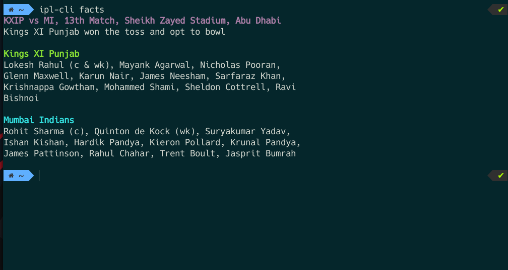

# IPL CLI

Live IPL scores CLI and little more

## Developing

### Prerequisites

npm >= 6.14

### Setting up Dev

```
git clone https://github.com/vikram710/ipl-cli
cd ipl-cli
npm install
npm link
```

### Uninstall 

```
npm unlink
```

## CLI Commands
```
ipl-cli --help ( to see the list of commands and description )
```
## Features
- Live Score updates 
- Match information
- Scorecard
- Points Table

# Demo




